<div align="center">


<br/>

<a href="#">
  
</a>

<br/><br/>

[](https://developer.mozilla.org/en-US/docs/Web/JavaScript)
[](https://nodejs.org)
[](#-mathematical-foundation)
[](#-what-is-threshold-cryptography)
[](#-security-considerations)

[](#-input-format)
[](https://git-scm.com)
[](https://github.com)
[](#-license)
[](#-license)
[](#-roadmap)

<br/>


<sub><i>Placeholder — replace with a real terminal capture or product screenshot before publishing.</i></sub>

<br/><br/>

<p>
  <a href="#-quick-start"><b>Quick Start</b></a> •
  <a href="#-mathematical-foundation"><b>How It Works</b></a> •
  <a href="#-architecture-diagram"><b>Architecture</b></a> •
  <a href="#-installation"><b>Installation</b></a> •
  <a href="#-contribution-guide"><b>Contributing</b></a> •
  <a href="#-connect-with-me"><b>Contact</b></a>
</p>

</div>

<br/>

> [!NOTE]
> **SecureShare is not an encryption library.** It is a **threshold secret sharing system**. It does not encrypt data confidentiality in the traditional sense — instead, it mathematically splits a secret into independent shares such that no subset below a defined threshold can learn anything about the original secret, and any subset at or above the threshold can reconstruct it exactly.

---

## 📖 Table of Contents

<details>
<summary><b>Click to expand full documentation index</b></summary>

<br/>

| | | |
|---|---|---|
| [1. Introduction](#-introduction) | [17. Example Walkthrough](#-example-walkthrough) | [33. Engineering Decisions](#-engineering-decisions) |
| [2. Vision](#-vision) | [18. System Workflow](#-system-workflow) | [34. Performance Analysis](#-performance-analysis) |
| [3. Mission](#-mission) | [19. Architecture Diagram](#-architecture-diagram) | [35. Time Complexity](#-time-complexity) |
| [4. Why SecureShare](#-why-secureshare) | [20. Technology Stack](#-technology-stack) | [36. Space Complexity](#-space-complexity) |
| [5. What is Threshold Cryptography](#-what-is-threshold-cryptography) | [21. Folder Structure](#-folder-structure) | [37. Security Considerations](#-security-considerations) |
| [6. What is Shamir's Secret Sharing](#-what-is-shamirs-secret-sharing) | [22. Project Modules](#-project-modules) | [38. Mathematical Proof Overview](#-mathematical-proof-overview) |
| [7. Mathematical Foundation](#-mathematical-foundation) | [23. Code Architecture](#-code-architecture) | [39. Edge Cases](#-edge-cases) |
| [8. Polynomial Generation](#-polynomial-generation) | [24. Installation](#-installation) | [40. Future Improvements](#-future-improvements) |
| [9. Secret Splitting Process](#-secret-splitting-process) | [25. Quick Start](#-quick-start) | [41. Lessons Learned](#-lessons-learned) |
| [10. Share Generation](#-share-generation) | [26. Input Format](#-input-format) | [42. Known Limitations](#-known-limitations) |
| [11. Share Distribution](#-share-distribution) | [27. Output Format](#-output-format) | [43. Contribution Guide](#-contribution-guide) |
| [12. Secret Reconstruction](#-secret-reconstruction) | [28. Local Development](#-local-development) | [44. License](#-license) |
| [13. Lagrange Interpolation](#-lagrange-interpolation) | [29. Example Commands](#-example-commands) | [45. Acknowledgements](#-acknowledgements) |
| [14. Step-by-Step Algorithm](#-step-by-step-algorithm) | [30. JSON Examples](#-json-examples) | [46. Author](#-author) |
| [15. Screenshots](#-screenshots) | [31. Demo](#-demo) | [47. Connect With Me](#-connect-with-me) |
| [16. Roadmap Table](#-future-improvements) | [32. Data Flow](#-system-workflow) | [48. Footer](#securesharedistributed-secret-sharing) |

</details>

---

## 🧭 Introduction

**SecureShare** is a from-scratch implementation of **Shamir's Secret Sharing (SSS)** scheme — a foundational algorithm in threshold cryptography, originally proposed by Adi Shamir in 1979. The project takes a single sensitive value (the *secret*) and mathematically distributes it across `n` independent shares, such that:

- Any `k` (the *threshold*) or more shares can perfectly reconstruct the original secret.
- Any `k - 1` or fewer shares reveal **absolutely nothing** about the secret — not even a probabilistic hint.

This repository is built as a clean, readable, and well-tested reference implementation in **Node.js**, designed to be both an educational resource for engineers learning threshold cryptography and a practical starting point for systems that require distributed trust — such as key custody, multi-party approval flows, and disaster-recovery backup systems.

> [!IMPORTANT]
> SecureShare is intended for **learning, prototyping, and architecture reference**. See [Security Considerations](#-security-considerations) and [Known Limitations](#-known-limitations) before using any derivative of this code in a production security boundary.

---

## 🌌 Vision

To make **threshold cryptography** approachable — stripping away the intimidating mathematical notation typically found in academic papers, and replacing it with clear diagrams, working code, and a step-by-step mental model that any software engineer can follow, regardless of their background in abstract algebra.

---

## 🎯 Mission

<table>
<tr>
<td width="50%" valign="top">

### What SecureShare Does

- Splits a secret into `n` independently useless shares
- Enforces a configurable reconstruction threshold `k`
- Reconstructs the exact original secret from any `k` valid shares
- Operates entirely over a **finite field** (modular arithmetic over a large prime) to guarantee information-theoretic security properties

</td>
<td width="50%" valign="top">

### What SecureShare Does Not Do

- It does **not** encrypt data at rest or in transit
- It does **not** manage share distribution/transport security
- It does **not** provide authentication of share holders
- It does **not** replace an HSM, KMS, or vault product

</td>
</tr>
</table>

---

## 💡 Why SecureShare

| Problem | Traditional Approach | SecureShare Approach |
|---|---|---|
| A single admin holds the master key | Single point of failure & trust | Secret is split across `n` custodians |
| Losing one backup destroys recoverability | Single copy, single risk | Any `k` of `n` shares reconstruct the secret |
| Compromise of one credential store leaks everything | Full secret sits in one place | A single share leaks **zero** information |
| Manual key-splitting via ad-hoc XOR tricks | Insecure, non-standard, unreviewed | Formal, well-studied polynomial scheme |

> [!TIP]
> Think of SecureShare like a **bank vault requiring 3-of-5 keyholders**. No individual keyholder — nor any two of them together — can open the vault. Only when the threshold number show up together does the vault open.

---

## 🔐 What is Threshold Cryptography

**Threshold cryptography** is a branch of cryptography concerned with distributing trust across multiple parties instead of concentrating it in a single entity. A cryptographic operation — signing, decrypting, or in this case, *reconstructing a secret* — is only possible when a minimum number (`k`, the *threshold*) of participants (out of a total `n`) cooperate.

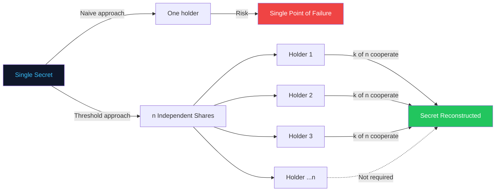

Threshold schemes are the backbone of real-world systems such as:

- **Multi-signature wallets** in blockchain custody
- **Root Certificate Authority key ceremonies**
- **Distributed key management** in cloud KMS/HSM clusters
- **Disaster recovery** for master encryption keys

---

## 🧩 What is Shamir's Secret Sharing

Shamir's Secret Sharing (SSS) is a specific, elegant construction of threshold cryptography based on a simple but powerful idea from algebra:

> **A polynomial of degree `k-1` is uniquely determined by any `k` distinct points on it.**

SecureShare exploits this property directly:

1. The **secret** becomes the constant term of a randomly generated polynomial.
2. The polynomial's degree is `k - 1`, where `k` is the reconstruction threshold.
3. `n` points are evaluated on this polynomial — these become the **shares**.
4. Given any `k` of these points, the original polynomial (and therefore the secret) can be **uniquely reconstructed** using Lagrange interpolation.
5. Given fewer than `k` points, **infinitely many polynomials** could fit — meaning the secret remains perfectly hidden.

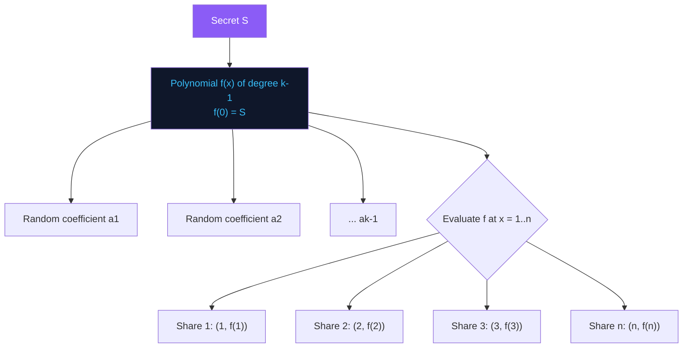

---

## 🧮 Mathematical Foundation

SecureShare operates over a **finite field** `GF(p)`, where `p` is a large prime greater than both the secret and the number of shares. All arithmetic — addition, multiplication, and division — is performed **modulo `p`**, which guarantees:

- Every operation stays within a bounded, well-defined set of integers
- Modular inverses exist for every non-zero element (required for interpolation)
- The scheme achieves **information-theoretic security** — not just computational security

### Core Polynomial

<div align="center">

**f(x) = S + a₁x¹ + a₂x² + ... + a₍ₖ₋₁₎x⁽ᵏ⁻¹⁾ (mod p)**

</div>

| Symbol | Meaning |
|---|---|
| `S` | The secret to be protected (constant term, `f(0) = S`) |
| `k` | Reconstruction threshold — minimum shares required |
| `n` | Total number of shares generated |
| `a₁ ... a₍ₖ₋₁₎` | Cryptographically random coefficients |
| `p` | A large prime defining the finite field `GF(p)` |
| `f(x)` | The secret-sharing polynomial |
| `(x, f(x))` | A single share — an (x, y) coordinate pair |

> [!NOTE]
> The coefficients `a₁` through `a₍ₖ₋₁₎` are generated using a cryptographically secure random source. Their randomness is what guarantees that observing fewer than `k` shares yields **no statistical advantage** in guessing the secret.

---

## 🌱 Polynomial Generation

The share-generation process begins by constructing a random polynomial whose constant term encodes the secret.

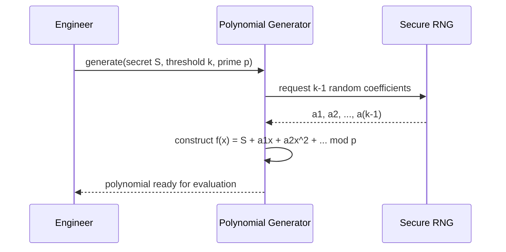

**Steps performed internally:**

| Step | Operation | Purpose |
|---|---|---|
| 1 | Validate `k ≤ n` | Threshold cannot exceed total shares |
| 2 | Select prime `p > S` and `p > n` | Ensures field is large enough |
| 3 | Set `a₀ = S` | Embeds the secret as the constant term |
| 4 | Generate `a₁ ... a₍ₖ₋₁₎` randomly in `[0, p-1]` | Adds entropy/degree |
| 5 | Return coefficient array | Polynomial ready for evaluation |

---

## ✂️ Secret Splitting Process

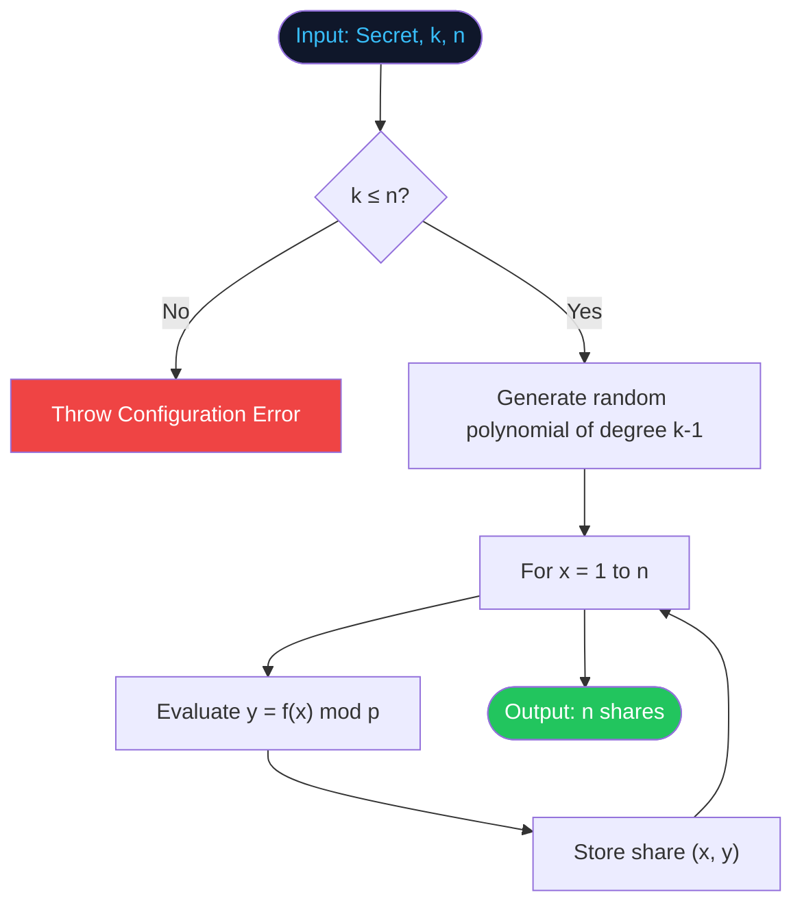

Splitting is a **one-way, purely computational** transformation — no network calls, no external state. Given the same secret, threshold, and prime but *fresh randomness*, the resulting shares will differ every run, while still reconstructing to the identical secret.

---

## 🧾 Share Generation

Each share is simply an `(x, y)` coordinate pair, where `x` is the share index (`1, 2, 3, ... n`) and `y = f(x) mod p`.

```
Share 1 → (1, f(1))
Share 2 → (2, f(2))
Share 3 → (3, f(3))
   ⋮
Share n → (n, f(n))
```

| Field | Type | Description |
|---|---|---|
| `x` | Integer | Public share index, safe to store alongside the share |
| `y` | Integer (mod p) | The evaluated polynomial value — the secret-bearing component |
| `k` | Integer | Threshold metadata, required at reconstruction time |
| `p` | Integer | Prime modulus, required at reconstruction time |

> [!WARNING]
> While a share reveals nothing about the secret on its own, `k` and `p` **should still be treated as sensitive configuration metadata** in most real deployments, since they describe the security parameters of the scheme.

---

## 📦 Share Distribution

SecureShare intentionally does **not** implement transport or storage of shares — this is left to the integrating system, since distribution security depends entirely on the deployment context (HSMs, air-gapped custodians, encrypted channels, etc.).

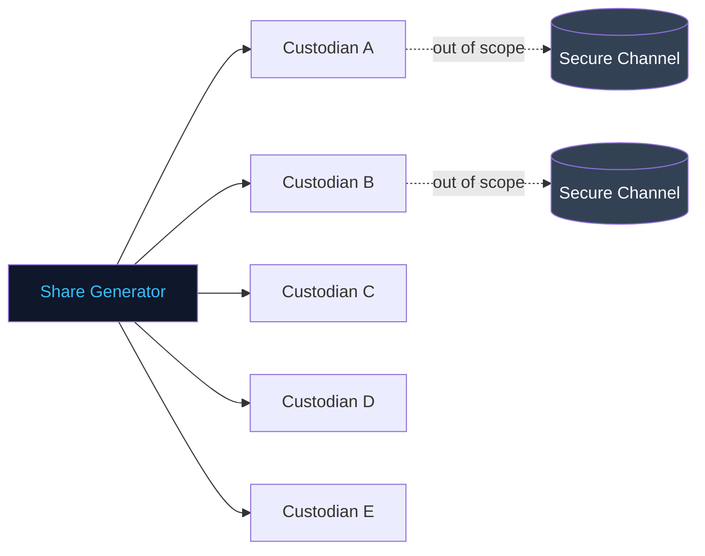

Recommended distribution patterns (not implemented in this repo, listed for architectural reference):

- Deliver shares over independently authenticated, encrypted channels
- Store each share in a **physically or organizationally separate** trust domain
- Rotate the secret (regenerate shares) periodically per your key-management policy

---

## 🔓 Secret Reconstruction

Reconstruction is the inverse operation: given `k` or more valid `(x, y)` shares, SecureShare rebuilds the original polynomial's constant term — the secret — using **Lagrange interpolation**, evaluated at `x = 0`.

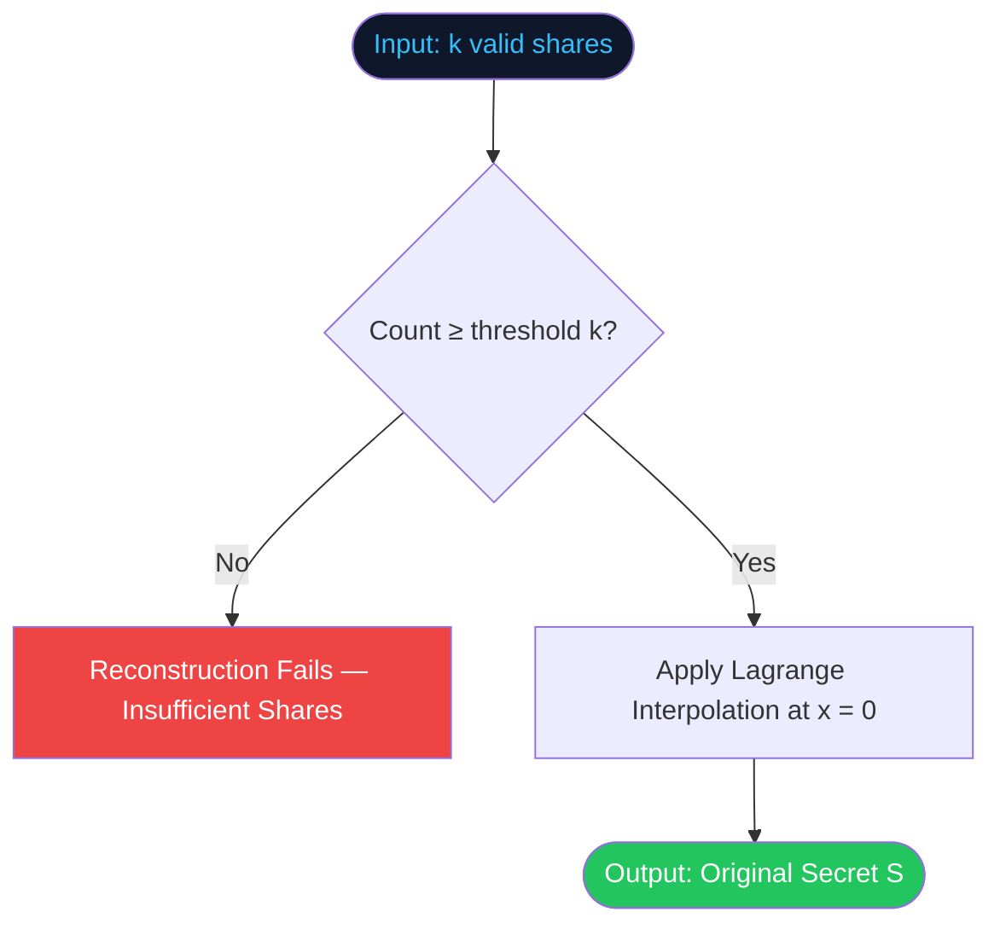

> [!CAUTION]
> Providing shares from **two different splitting runs**, or providing corrupted/tampered shares, will not raise an error by default — it will silently produce an **incorrect secret**. See [Edge Cases](#-edge-cases) for mitigation strategies.

---

## 📐 Lagrange Interpolation

Lagrange interpolation reconstructs a polynomial `f(x)` from a set of `k` known points, then evaluates it at `x = 0` to recover the secret `S = f(0)`.

<div align="center">

**f(0) = Σ [ yᵢ · Lᵢ(0) ]  (mod p)**

**Lᵢ(0) = Π [ (0 − xⱼ) / (xᵢ − xⱼ) ]  for all j ≠ i (mod p)**

</div>

| Symbol | Meaning |
|---|---|
| `yᵢ` | The y-value of share `i` |
| `Lᵢ(0)` | The Lagrange basis polynomial for share `i`, evaluated at `x = 0` |
| `xᵢ, xⱼ` | The x-coordinates (indices) of the shares being combined |
| Division | Performed as multiplication by the **modular inverse** under `GF(p)` |

**Conceptually:** each basis term `Lᵢ(0)` acts as a weight that is `1` at its own share's x-coordinate and `0` at every other share's x-coordinate used in the interpolation. Summing the weighted y-values collapses precisely to `f(0) = S`.

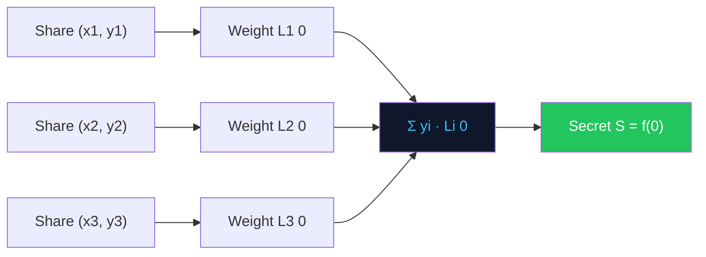

---

## 🪜 Step-by-Step Algorithm

<table>
<tr><th>Phase</th><th>Step</th><th>Description</th></tr>
<tr><td rowspan="5" valign="top"><b>Splitting</b></td>
<td>1</td><td>Choose prime <code>p</code> greater than secret and <code>n</code></td></tr>
<tr><td>2</td><td>Set constant term <code>a₀ = secret</code></td></tr>
<tr><td>3</td><td>Randomly generate <code>k - 1</code> additional coefficients</td></tr>
<tr><td>4</td><td>Evaluate polynomial at <code>x = 1 .. n</code></td></tr>
<tr><td>5</td><td>Emit <code>n</code> shares as <code>(x, y)</code> pairs</td></tr>
<tr><td rowspan="4" valign="top"><b>Reconstruction</b></td>
<td>6</td><td>Collect ≥ <code>k</code> shares</td></tr>
<tr><td>7</td><td>Compute Lagrange basis weight for each share</td></tr>
<tr><td>8</td><td>Sum weighted y-values modulo <code>p</code></td></tr>
<tr><td>9</td><td>Return result as reconstructed secret</td></tr>
</table>

---

## 🧪 Example Walkthrough

**Scenario:** Split the secret `1234` into `n = 5` shares with a threshold of `k = 3`, using prime `p = 2087`.

```
Input:
  secret    = 1234
  threshold = 3
  shares    = 5
  prime     = 2087

Randomly generated polynomial (degree k-1 = 2):
  f(x) = 1234 + 166x + 94x^2  (mod 2087)

Generated shares:
  Share 1 → (1, 1494)
  Share 2 → (2, 1942)
  Share 3 → (3, 578)
  Share 4 → (4, 1402)
  Share 5 → (5, 514)
```

**Reconstructing using shares 1, 3, and 5** (any 3 of the 5 work identically):

```
Selected shares:
  (1, 1494)
  (3, 578)
  (5, 514)

Apply Lagrange interpolation at x = 0:
  → f(0) = 1234

Reconstructed secret = 1234  ✅ matches original
```

> [!TIP]
> Try reconstructing with shares `{2, 4}` only (below the threshold of 3) — the math will produce a value, but it will **not** equal `1234`, since two points under-determine a degree-2 polynomial.

---

## 🔄 System Workflow

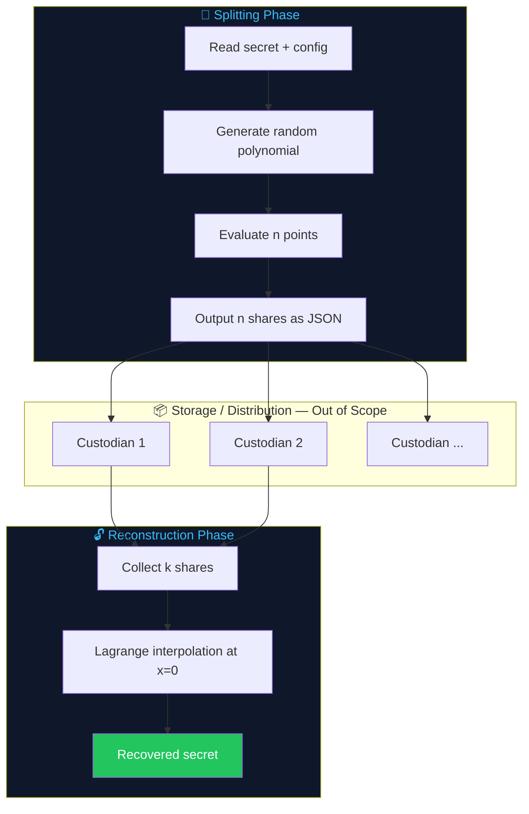

---

## 🏗️ Architecture Diagram

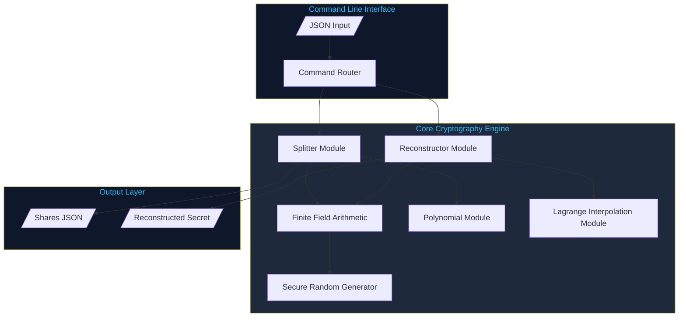

---

## 🛠️ Technology Stack

| Category | Technology | Purpose |
|---|---|---|
| Language |  | Core implementation language |
| Runtime |  | Execution environment |
| Algorithms | Shamir's Secret Sharing | Core threshold cryptography scheme |
| Algorithms | Lagrange Interpolation | Polynomial reconstruction |
| Algorithms | Polynomial Mathematics | Coefficient generation & evaluation |
| Algorithms | Modular / Finite Field Arithmetic | Security guarantees over `GF(p)` |
| Data Format |  | Input/output interchange |
| Tooling |  | Version control |
| Hosting |  | Source hosting & collaboration |

---

## 🗂️ Folder Structure

```
SecureShare/
├── src/
│   ├── core/
│   │   ├── polynomial.js         # Polynomial generation & evaluation
│   │   ├── field.js              # Finite field / modular arithmetic
│   │   ├── lagrange.js           # Lagrange interpolation logic
│   │   └── random.js             # Secure coefficient randomness
│   ├── split.js                  # Secret splitting entry point
│   ├── reconstruct.js            # Secret reconstruction entry point
│   └── cli.js                    # Command-line interface
├── examples/
│   ├── split-input.json          # Example split input
│   └── shares-output.json        # Example generated shares
├── test/
│   ├── polynomial.test.js
│   ├── lagrange.test.js
│   └── e2e.test.js
├── docs/
│   └── assets/                   # Diagrams, screenshots (placeholders)
├── .gitignore
├── package.json
├── LICENSE
└── README.md
```

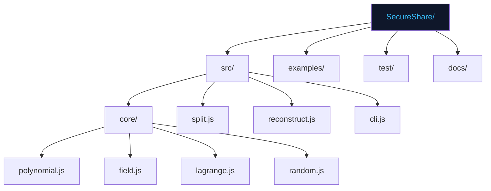

---

## 🧱 Project Modules

| Module | File | Responsibility |
|---|---|---|
| **Polynomial Engine** | `core/polynomial.js` | Generates the random polynomial and evaluates it at given `x` values |
| **Finite Field Arithmetic** | `core/field.js` | Implements addition, multiplication, and modular inverse over `GF(p)` |
| **Lagrange Interpolator** | `core/lagrange.js` | Reconstructs `f(0)` from a set of shares |
| **Secure Randomness** | `core/random.js` | Supplies cryptographically secure random coefficients |
| **Splitter** | `split.js` | Orchestrates the full secret-splitting workflow |
| **Reconstructor** | `reconstruct.js` | Orchestrates the full secret-reconstruction workflow |
| **CLI** | `cli.js` | Parses commands/flags and routes to split or reconstruct |

---

## 🏛️ Code Architecture

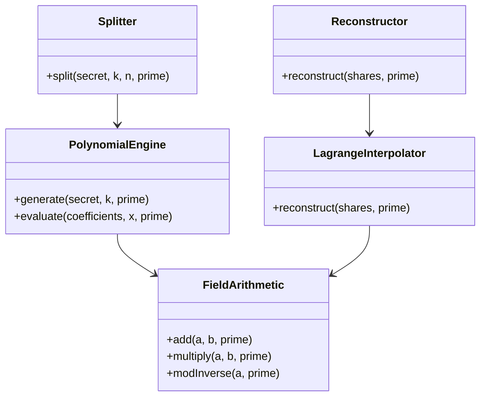

SecureShare follows a **layered, single-responsibility module design**:

1. **Field layer** — pure modular arithmetic, no knowledge of secrets or shares
2. **Polynomial layer** — builds on the field layer to generate/evaluate polynomials
3. **Orchestration layer** — `split.js` / `reconstruct.js` compose the above into end-to-end workflows
4. **Interface layer** — `cli.js` is the only module aware of JSON I/O and process arguments

---

## ⚙️ Installation

```bash
# 1. Clone the repository
git clone https://github.com/your-username/secureshare.git

# 2. Move into the project directory
cd secureshare

# 3. Install dependencies
npm install

# 4. Verify installation
node src/cli.js --version
```

| Requirement | Minimum Version |
|---|---|
| Node.js | 18.x or later |
| npm | 9.x or later |
| OS | macOS, Linux, Windows (WSL recommended) |

---

## 🚀 Quick Start

```bash
# Split a secret into 5 shares with a threshold of 3
node src/cli.js split --secret 1234 --threshold 3 --shares 5

# Reconstruct the secret from a set of shares
node src/cli.js reconstruct --input shares-output.json
```

**Expected output (split):**

```json
{
  "threshold": 3,
  "totalShares": 5,
  "prime": 2087,
  "shares": [
    { "x": 1, "y": 1494 },
    { "x": 2, "y": 1942 },
    { "x": 3, "y": 578 },
    { "x": 4, "y": 1402 },
    { "x": 5, "y": 514 }
  ]
}
```

**Expected output (reconstruct):**

```json
{
  "secret": 1234,
  "sharesUsed": 3,
  "status": "reconstructed"
}
```

---

## 📥 Input Format

```json
{
  "secret": 1234,
  "threshold": 3,
  "totalShares": 5
}
```

| Field | Type | Required | Description |
|---|---|---|---|
| `secret` | Integer | ✅ | The value to be split (must be smaller than the chosen prime) |
| `threshold` | Integer | ✅ | Minimum number of shares required to reconstruct |
| `totalShares` | Integer | ✅ | Total number of shares to generate (`n ≥ threshold`) |
| `prime` | Integer | ❌ | Optional custom prime; auto-selected if omitted |

---

## 📤 Output Format

```json
{
  "threshold": 3,
  "totalShares": 5,
  "prime": 2087,
  "shares": [
    { "x": 1, "y": 1494 },
    { "x": 2, "y": 1942 },
    { "x": 3, "y": 578 }
  ]
}
```

| Field | Type | Description |
|---|---|---|
| `threshold` | Integer | Reconstruction threshold used |
| `totalShares` | Integer | Total shares generated |
| `prime` | Integer | Prime modulus used for the finite field |
| `shares[].x` | Integer | Public share index |
| `shares[].y` | Integer | Secret-bearing evaluated value |

---

## 💻 Local Development

```bash
# Run the test suite
npm test

# Run with watch mode
npm run test:watch

# Lint the codebase
npm run lint

# Run a specific module's unit tests
npx mocha test/lagrange.test.js
```

---

## 📟 Example Commands

```bash
# Split with default prime selection
node src/cli.js split --secret 42 --threshold 2 --shares 4

# Split with an explicit prime
node src/cli.js split --secret 42 --threshold 2 --shares 4 --prime 257

# Reconstruct from a JSON file
node src/cli.js reconstruct --input ./examples/shares-output.json

# Reconstruct from inline shares
node src/cli.js reconstruct --shares '[{"x":1,"y":1494},{"x":3,"y":578},{"x":5,"y":514}]'
```

---

## 🧾 JSON Examples

<details>
<summary><b>Split Request</b></summary>

```json
{
  "secret": 987654,
  "threshold": 4,
  "totalShares": 8
}
```
</details>

<details>
<summary><b>Split Response</b></summary>

```json
{
  "threshold": 4,
  "totalShares": 8,
  "prime": 1299709,
  "shares": [
    { "x": 1, "y": 884213 },
    { "x": 2, "y": 411058 },
    { "x": 3, "y": 1027764 },
    { "x": 4, "y": 220981 },
    { "x": 5, "y": 673402 },
    { "x": 6, "y": 105827 },
    { "x": 7, "y": 998113 },
    { "x": 8, "y": 550349 }
  ]
}
```
</details>

<details>
<summary><b>Reconstruct Request</b></summary>

```json
{
  "shares": [
    { "x": 1, "y": 884213 },
    { "x": 4, "y": 220981 },
    { "x": 6, "y": 105827 },
    { "x": 8, "y": 550349 }
  ],
  "prime": 1299709
}
```
</details>

<details>
<summary><b>Reconstruct Response</b></summary>

```json
{
  "secret": 987654,
  "sharesUsed": 4,
  "status": "reconstructed"
}
```
</details>

---

## 🖼️ Screenshots

<div align="center">


<sub>Placeholder — add a real terminal screenshot of the `split` command here.</sub>

<br/><br/>


<sub>Placeholder — add a real terminal screenshot of the `reconstruct` command here.</sub>

</div>

---

## 🎬 Demo

<div align="center">


<sub>Placeholder — replace with an animated GIF demoing the full split → distribute → reconstruct flow.</sub>

</div>

---

## 🧠 Engineering Decisions

| Decision | Rationale |
|---|---|
| Pure JavaScript, zero heavy dependencies | Keeps the cryptographic core auditable and easy to reason about |
| Finite field arithmetic implemented explicitly | Avoids floating-point precision issues inherent to standard JS numbers |
| CLI-first interface | Simplifies scripting, testing, and integration into pipelines |
| JSON as the canonical I/O format | Language-agnostic, easy to pipe into other tooling |
| Threshold validated at split-time | Fails fast on invalid configuration rather than silently producing broken shares |
| Explicit prime parameter (optional) | Gives advanced users control while providing sane defaults for everyone else |

---

## 📊 Performance Analysis

> [!NOTE]
> No formal benchmark numbers are published in this repository. The table below describes **algorithmic behavior**, not measured throughput — run your own benchmarks (`npm run bench`, once added) before making capacity decisions.

| Operation | Dominant Cost | Scales With |
|---|---|---|
| Polynomial generation | Random coefficient generation | `O(k)` |
| Share generation | Polynomial evaluation per share | `O(n · k)` |
| Reconstruction | Lagrange basis computation | `O(k²)` |
| Modular inverse | Extended Euclidean algorithm | `O(log p)` per inverse |

---

## ⏱️ Time Complexity

| Phase | Complexity | Notes |
|---|---|---|
| Splitting | `O(n · k)` | `n` shares, each requiring `O(k)` polynomial evaluation |
| Reconstruction | `O(k² )` | Each of `k` basis terms requires `O(k)` work, plus `O(log p)` for modular inverses |
| Modular Inverse | `O(log p)` | Extended Euclidean algorithm |
| Overall Reconstruction (with inverses) | `O(k² · log p)` | Dominant cost for large thresholds |

---

## 💾 Space Complexity

| Structure | Complexity | Notes |
|---|---|---|
| Polynomial coefficients | `O(k)` | One coefficient per polynomial degree |
| Generated shares | `O(n)` | One `(x, y)` pair per share |
| Reconstruction working set | `O(k)` | Only the `k` shares being combined are held in memory |

---

## 🛡️ Security Considerations

> [!CAUTION]
> Read this section fully before adapting SecureShare for any production security boundary.

| Concern | Status in This Repository | Recommendation |
|---|---|---|
| Randomness source | Uses platform CSPRNG for coefficients | Verify your Node.js runtime's `crypto` module is FIPS-compliant if required |
| Share transport security | **Out of scope** | Use authenticated, encrypted channels per custodian |
| Share storage | **Out of scope** | Store in isolated trust domains (HSMs, separate vaults, etc.) |
| Prime size vs. secret size | Prime must exceed secret and share count | Validate this at integration time for your data's value range |
| Side-channel resistance | Not hardened (educational implementation) | Do not use as-is for high-assurance HSM-grade deployments |
| Share integrity / authentication | Not implemented | Add MACs or signatures over shares if tamper-detection is required |
| Secret size limits | Bound by prime field size | Large secrets (e.g. full files) require chunking or hybrid encryption schemes |

This is **not** a substitute for audited, production-hardened libraries (e.g. `libsodium`, HashiCorp Vault's Shamir implementation) in regulated or high-value environments.

---

## 📜 Mathematical Proof Overview

**Claim:** Given `k` distinct points `(x₁, y₁), ..., (xₖ, yₖ)` on a polynomial `f(x)` of degree `k - 1`, the polynomial — and therefore `f(0)` — is uniquely determined.

**Sketch of proof:**

1. A polynomial of degree `d` is uniquely defined by `d + 1` coefficients.
2. Each known point `(xᵢ, yᵢ)` provides one independent linear equation relating those coefficients.
3. With `k = d + 1` points, the resulting system of `k` linear equations in `k` unknowns has a **unique solution** (the Vandermonde matrix formed by distinct `xᵢ` values is invertible).
4. Lagrange interpolation is a closed-form method for solving this system directly, without explicitly inverting the Vandermonde matrix.
5. With fewer than `k` points, the system is **underdetermined** — infinitely many degree-`(k-1)` polynomials satisfy the known points, each implying a different, equally plausible value for `f(0)`. This is what gives the scheme its **information-theoretic** (not just computational) security guarantee below the threshold.

---

## ⚠️ Edge Cases

| Edge Case | Behavior | Mitigation |
|---|---|---|
| Fewer than `k` shares provided | Produces an incorrect result silently | Application layer should track and enforce minimum share count |
| Duplicate `x` values among shares | Breaks interpolation (division by zero in basis calculation) | Validate share uniqueness before reconstruction |
| Shares from two different splitting runs mixed together | Silently reconstructs garbage | Tag shares with a run/session identifier |
| Secret ≥ prime modulus | Produces wraparound/incorrect encoding | Select a prime strictly greater than the secret |
| `threshold > totalShares` | Invalid configuration | Rejected at split-time with a configuration error |
| Negative or non-integer secret | Undefined behavior in current implementation | Encode as a non-negative integer within field bounds beforehand |

---

## 🗺️ Future Improvements

| Feature | Status | Priority |
|---|---|---|
| Support for splitting arbitrary byte strings (not just integers) | Planned | High |
| Share integrity verification (MAC/signature per share) | Planned | High |
| Verifiable Secret Sharing (VSS) support | Under Consideration | Medium |
| Web-based visualizer for polynomial/interpolation demo | Planned | Medium |
| Benchmark suite with published methodology | Planned | Medium |
| TypeScript type definitions | Planned | Low |
| WASM-accelerated field arithmetic | Under Consideration | Low |

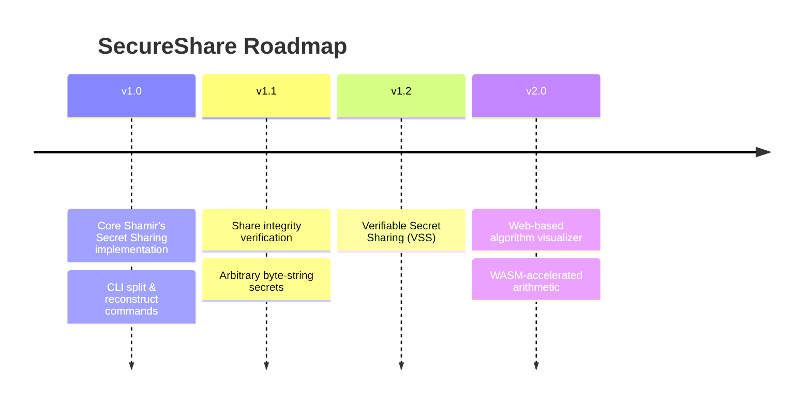

---

## 📚 Lessons Learned

- Modular arithmetic edge cases (particularly modular inverses of negative intermediate values) require careful, explicit handling in JavaScript, since the native `%` operator does not behave like true mathematical modulo for negative numbers.
- Clear separation between the **field arithmetic layer** and the **polynomial layer** made testing dramatically simpler — each layer could be verified in complete isolation.
- Designing the JSON I/O contract early (before writing the CLI) made it much easier to keep the core cryptographic logic free of any I/O concerns.

---

## 🚧 Known Limitations

- Secrets must be encoded as integers smaller than the chosen prime; there is no built-in support for splitting arbitrary-length data yet.
- No built-in mechanism for detecting corrupted or tampered shares (no MAC/signature layer).
- No built-in transport or storage security — this is explicitly left to the integrating system.
- Not independently audited by a third-party cryptography firm.

---

## 🤝 Contribution Guide

Contributions are very welcome — whether it's a bug fix, a new feature, improved documentation, or additional test coverage.

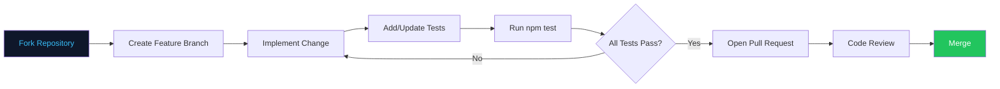

**Steps to contribute:**

```bash
# 1. Fork and clone your fork
git clone https://github.com/your-username/secureshare.git

# 2. Create a feature branch
git checkout -b feature/your-feature-name

# 3. Make your changes, then run the test suite
npm test

# 4. Commit using a clear, descriptive message
git commit -m "feat: add verifiable secret sharing support"

# 5. Push and open a pull request
git push origin feature/your-feature-name
```

| Contribution Type | Guidelines |
|---|---|
| Bug fixes | Include a regression test that fails before your fix and passes after |
| New features | Open an issue first to discuss scope before submitting a large PR |
| Documentation | Keep tone consistent with the rest of this README |
| Cryptographic changes | Explain the mathematical reasoning clearly in the PR description |

> [!IMPORTANT]
> Any change to `core/field.js`, `core/polynomial.js`, or `core/lagrange.js` touches the cryptographic core of this project. Please include thorough test cases and a clear explanation of the mathematical correctness in your pull request.

---

## 📄 License

This project is licensed under the **MIT License**.

```
MIT License

Copyright (c) 2025 [Your Name]

Permission is hereby granted, free of charge, to any person obtaining a copy
of this software and associated documentation files (the "Software"), to deal
in the Software without restriction, including without limitation the rights
to use, copy, modify, merge, publish, distribute, sublicense, and/or sell
copies of the Software, subject to the following conditions:

The above copyright notice and this permission notice shall be included in
all copies or substantial portions of the Software.

THE SOFTWARE IS PROVIDED "AS IS", WITHOUT WARRANTY OF ANY KIND, EXPRESS OR
IMPLIED, INCLUDING BUT NOT LIMITED TO THE WARRANTIES OF MERCHANTABILITY,
FITNESS FOR A PARTICULAR PURPOSE AND NONINFRINGEMENT.
```

See the [LICENSE](./LICENSE) file for the full text.

---

## 🙏 Acknowledgements

- **Adi Shamir** — for the original 1979 paper *"How to Share a Secret,"* which this project directly implements.
- The broader **applied cryptography community**, whose open lectures, notes, and reference implementations made this project's documentation possible.
- Open-source tooling used in development: Node.js, Mocha/Chai (testing), ESLint (linting).

---

## 👤 Author

<div align="center">


### Your Name

*Software Engineer • Cryptography Enthusiast • Algorithm Engineer*

</div>

---

## 🔗 Connect With Me

<div align="center">

[](https://github.com/your-username)
[](https://linkedin.com/in/your-profile)
[](https://your-portfolio.dev)
[](mailto:you@example.com)

</div>

---

<div align="center">


<br/>

**SecureShare** — Distributed Secret Sharing using Shamir's Secret Sharing Algorithm

<sub>Built with polynomial mathematics, finite field arithmetic, and a healthy respect for threshold cryptography. Not affiliated with any commercial security vendor. Educational and prototyping use — see <a href="#-security-considerations">Security Considerations</a> before production adoption.</sub>

<br/><br/>

⭐ **If this project helped you understand threshold cryptography, consider starring the repository.** ⭐

</div>
